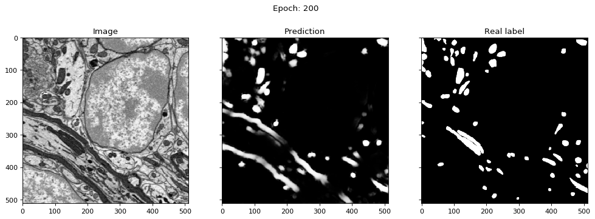
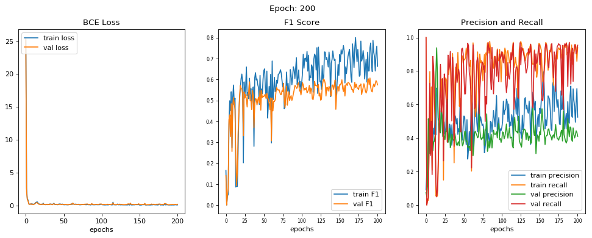

# 2D Unet For Biomedical Image Segmentation

## Lucas Tindall

# Environment
1. Python 3, Pytorch (0.3.1.post3)

# Setup 
1. Clone this repo

# Run
1. python [2D_Unet.py](2D_Unet.py)
2. or run Jupyter notebook [2D_Unet.ipynb](2D_Unet.ipynb)

# Results

